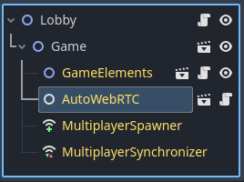

# Auto WebRTC

Automatically creates a WebRTC connection from an existing WebSocket connection in a parent node.

## Description

When designing multiplayer games in Godot, there are two options available for
web games:

1. [WebSocket](https://docs.godotengine.org/en/stable/tutorials/networking/websocket.html), which uses TCP for a reliable (but potentially laggy) connection between a client and server.

2. [WebRTC](https://docs.godotengine.org/en/stable/tutorials/networking/webrtc.html), which uses UDP for real-time communication between peers.

WebSockets (specifically [WebSocketMultiplayerPeers](https://docs.godotengine.org/en/stable/classes/class_websocketmultiplayerpeer.html)) are by far the easier option to set up, and should be the first approach you try.  Depending on the
type of multiplayer game you're working on, this may be more than sufficient
for your needs.

However, if you experience significant lag with your multiplayer connections,
you may want to try WebRTC for speed-critical parts of your scene tree.

This "AutoWebRTC" node can help you set that up painlessly.

Simply add it as an immediate child of a scene, and that scene (and all its
children) will be automatically configured with a WebRTC connection.

As an example, suppose you have a "Lobby" scene set up with a
WebSocketMultiplayerPeer connection for managing incoming players.
The game itself (represented by a "Game" scene) requires real-time
synchronization of player coordinates, so it's imbued with an AutoWebRTC node.
It's children (and all descendents) would automatically use a WebRTC connection 
for communication with the multiplayer server.

## Caveats

You need to have a WebSocketMultiplayerPeer set up in a parent scene.  This
will still require some amount of work (e.g. you'll probably need to have a web
domain, a certificate, and a VPN for hosting a server).  Web-based multiplayer
is still a pain, no way around that.

The AutoWebRTC node does a 1:1 mapping of the existing client/server connection
already established from a WebSocket, and is not designed for the more general
case of full peer-to-peer meshes.  That would require a lot more work (STUN, and
possibly TURN) to establish the connections, and is beyond the scope of this
project.

This node cannot be used recursively, because Godot does not allow for nested
custom MultiplayerAPIs.  However, it can be used in multiple sibling scenes to
allow for things like different multiplayer zones for different sets of peers.

On the server side, you'll need a [plugin](https://github.com/godotengine/webrtc-native) for WebRTC support.  No plugins are needed for the client side, if
running as a Web app.
